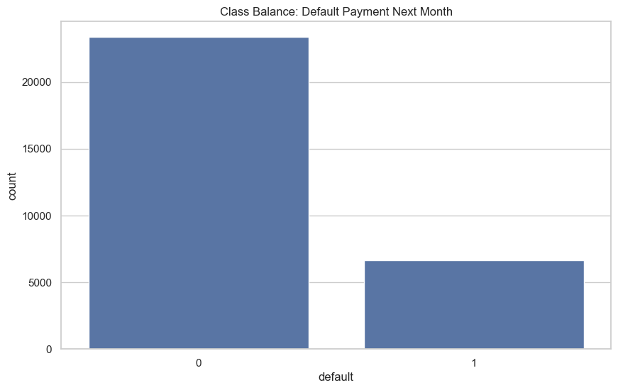
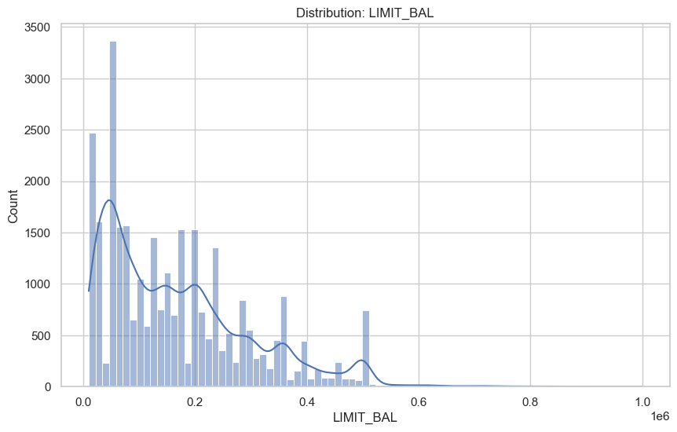
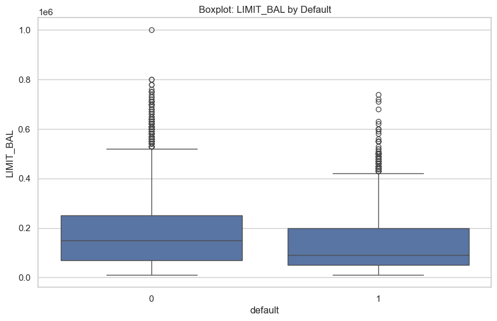
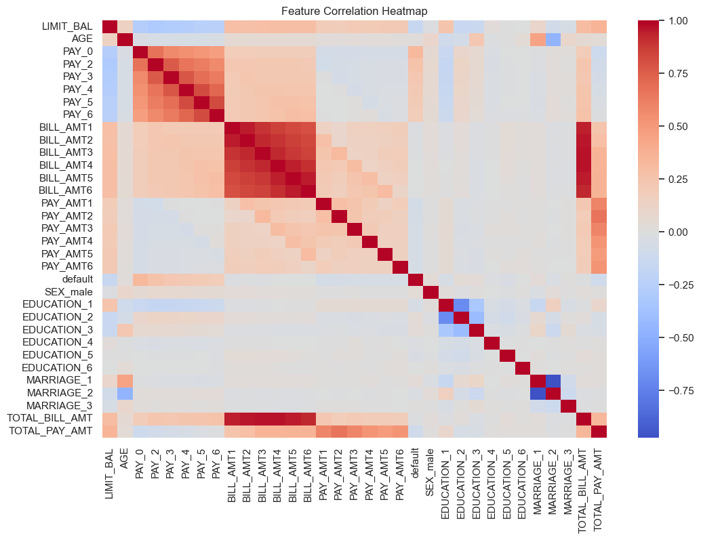
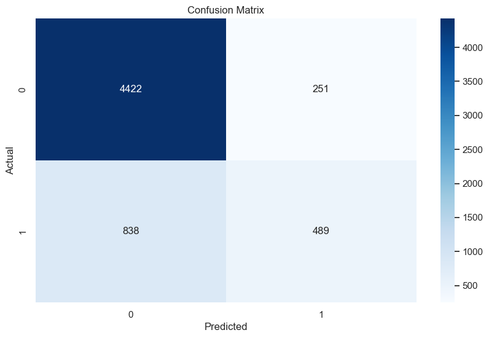
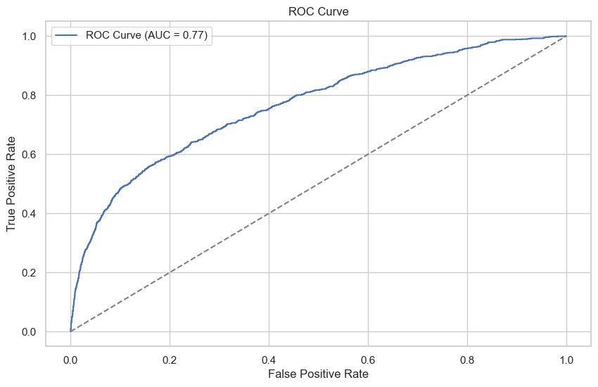
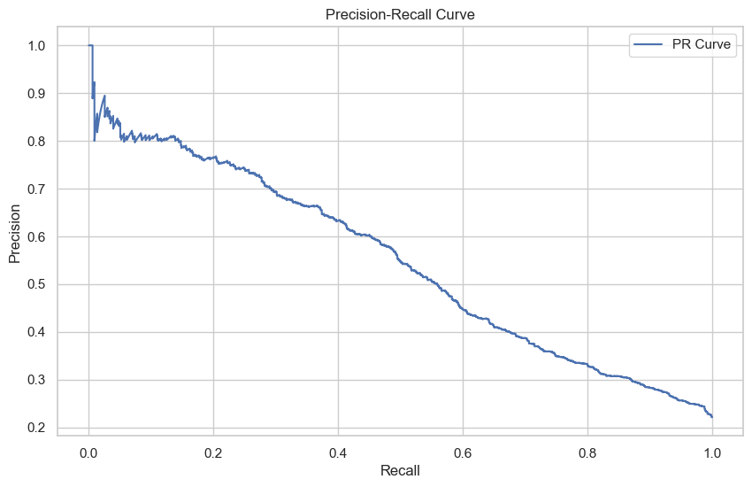

# GenAI-Enhanced Financial Risk Platform

A modern, explainable AI platform for credit risk assessment using neural networks, hybrid scoring, and business-driven insights.

---

## 🚀 Project Overview
This project delivers an end-to-end, AI-powered financial risk prediction system using real-world credit data. It combines deep learning, rule-based logic, and explainability to help financial institutions identify, understand, and manage credit risk with confidence.

---

## 🏆 Key Features
- **End-to-end ETL, EDA, and model training**
- **Hybrid AI + rule-based scoring** for robust risk assessment
- **SHAP explainability** for transparent, compliant decisions
- **Cumulative gains/lift chart** for business impact
- **Batch prediction and top at-risk customer insights**
- **Professional visualizations and business-ready outputs**

---

## 🛠️ Tools & Technologies
- **Python 3.10**
- **TensorFlow/Keras** (deep learning)
- **scikit-learn** (ML, metrics, preprocessing)
- **pandas, numpy** (data wrangling)
- **matplotlib, seaborn** (visualization)
- **SHAP** (explainability)
- **LangChain/OpenAI** (optional, for LLM-based explanations)

---

## 🔍 Workflow & Explanations

### 1. Data Ingestion & ETL
- Loads and preprocesses the UCI Default of Credit Card Clients dataset.
- Cleans, encodes, and engineers features for modeling.

### 2. Exploratory Data Analysis (EDA)
- **Class Balance:**
  
  *Most customers do not default, but a significant minority do—highlighting the challenge of rare event prediction.*

- **Feature Distributions:**
  
  *Distribution of credit limits among customers.*

- **Outlier Detection:**
  
  *Boxplot shows how credit limit varies for defaulters vs. non-defaulters.*

- **Correlation Analysis:**
  
  *Visualizes relationships between features.*

### 3. Model Training & Evaluation
- **Neural network** trained to predict default risk.
- **Confusion Matrix:**
  
  *Shows true/false positives/negatives for model predictions.*
- **ROC Curve:**
  
  *Model’s ability to distinguish risky customers.*
- **Precision-Recall Curve:**
  
  *Performance on rare event detection.*

### 4. Feature Importance & Explainability
- **Permutation Importance:**
  
  *Top features driving model predictions.*
- **SHAP Summary Plot:**
  
  *Explains how features impact predictions globally.*

### 5. Business Impact & Cumulative Gains
- **Cumulative Gains Chart:**
  
  *Shows how well the model captures defaulters in the top X% of customers—demonstrating real business value.*

### 6. Batch Prediction & Insights
- **Top At-Risk Customers Table:**

| Customer Index | Predicted Risk | Hybrid Flag | LIMIT_BAL | AGE | PAY_0 | TOTAL_BILL_AMT | TOTAL_PAY_AMT |
|---------------|---------------|-------------|-----------|-----|-------|----------------|---------------|
| ...           | ...           | ...         | ...       | ... | ...   | ...            | ...           |

---

## ▶️ How to Run
1. Clone the repo
2. Install requirements: `pip install -r requirements.txt`
3. Download the UCI dataset and place it in `sample_data/` as described above
4. Run the notebook or script: `python notebooks/eda_model_training.py`
5. View results in the `figures/` directory and in the console output

---

## 💡 Business Impact
- **Identify high-risk customers** with advanced AI and business rules
- **Explain decisions** for compliance and transparency
- **Visualize and communicate risk insights** to stakeholders
- **Reduce false positives** and improve portfolio performance

---

